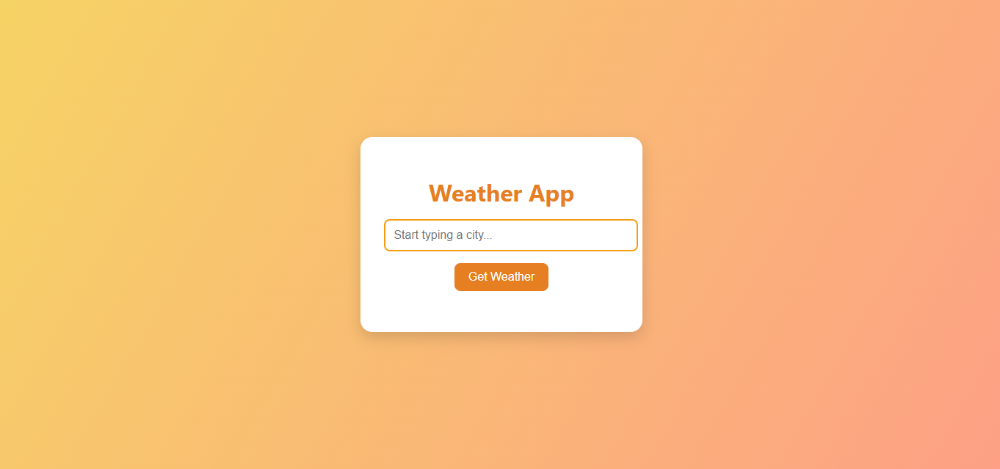

# 🌦️ Lab: SCSS Styling for a Local Weather App

## 🎯 Objective
In this lab, you will build a small weather app using **your own HTML** and style it with **SCSS (Sass)**. You will be given a working JavaScript file that handles data—you won't touch that. Your goal is to create the structure with HTML and make it beautiful using SCSS features like variables, nesting, mixins, and functions.


---

## 📁 Starter Files
You will receive the following files:

```
weather-lab/
├── index.html        ← You will write this
├── weatherData.js    ← Do not edit
├── app.js            ← Do not edit
├── style.scss        ← Your focus for this lab (SCSS!)
└── package.json      ← Updated with SCSS tools
```

> ✅ You will write `index.html` and style it in `style.scss` using SCSS features.

## 🎨 What is SCSS?

SCSS (Sass) is a **CSS preprocessor** that extends CSS with powerful features:

- **Variables**: Store colors, fonts, and values for reuse
- **Nesting**: Write cleaner, more organized code
- **Mixins**: Reusable code blocks
- **Functions**: Dynamic calculations and color manipulation
- **Partials**: Split code into smaller files

## 🧱 Step 1: Create the HTML Structure

Build the following structure in `index.html`:

- A page title (`<h1>Weather App</h1>`) inside a `<header>` tag
- An input field to type the city name (`<input type="text">`) inside a styled container
- A button to get the weather (`<button>Get Weather</button>`)
- A container to show suggestions (`<ul class="suggestions"></ul>`) under the input
- A container to display the weather info (`<div id="weatherInfo"></div>`) inside a `<section>`
- Use semantic HTML elements where possible: `<main>`, `<header>`, `<section>`, `<footer>`

Example layout (structure only):
```html
<header>
  <h1>Weather App</h1>
</header>
<main>
  <div class="input-group">
    <input type="text" id="cityInput" placeholder="Enter city...">
    <button id="getWeather">Get Weather</button>
    <ul class="suggestions"></ul>
  </div>
  <section id="weatherInfo"></section>
</main>
```

## 🎨 Step 2: Set Up SCSS Variables and Base Styles

Start your `style.scss` with SCSS variables and base styles:

```scss
// Variables - Define reusable values
$primary-color: #e67e22;
$secondary-color: #f39c12;
$background-gradient: linear-gradient(120deg, #f6d365, #fda085);
$border-radius: 0.5rem;
$box-shadow: 0 8px 20px rgba(0, 0, 0, 0.15);
$font-family: 'Segoe UI', Tahoma, Geneva, Verdana, sans-serif;

// Base styles using variables
body {
  font-family: $font-family;
  background: $background-gradient;
  height: 100vh;
  margin: 0;
  display: flex;
  justify-content: center;
  align-items: center;
  flex-flow: column;
}
```

## 🎨 Step 3: Use SCSS Nesting for Components

Practice SCSS nesting for cleaner, more organized code:

```scss
.container {
  background: white;
  padding: 2rem;
  border-radius: $border-radius;
  box-shadow: $box-shadow;
  width: 320px;
  text-align: center;
  display: flex;
  justify-content: center;
  
  // Nested styles for elements inside container
  h1 {
    margin-bottom: 1rem;
    color: $primary-color;
  }
  
  .input-group {
    // Input group styles
  }
}
```

## 🎨 Step 4: Create SCSS Mixins for Reusable Styles

Create mixins for common patterns:

```scss
// Mixin for button styles
@mixin button-style($bg-color: $primary-color, $text-color: white) {
  padding: 0.75rem 1.5rem;
  background-color: $bg-color;
  color: $text-color;
  border: none;
  border-radius: $border-radius;
  cursor: pointer;
  transition: all 0.3s ease;
  
  &:hover {
    background-color: darken($bg-color, 10%);
    transform: translateY(-2px);
  }
}

// Use the mixin
button {
  @include button-style();
}
```

## 🎨 Step 5: Style Input and Button with SCSS

Use SCSS features to style form elements:

```scss
input {
  width: 100%;
  padding: 0.75rem;
  border: 2px solid lighten($primary-color, 20%);
  border-radius: $border-radius;
  font-size: 1rem;
  margin-bottom: 1rem;
  
  &:focus {
    outline: none;
    border-color: $primary-color;
    box-shadow: 0 0 0 3px rgba($primary-color, 0.2);
  }
}

button {
  @include button-style();
  width: 100%;
}
```

## 🎨 Step 6: Dropdown Styling with SCSS

Style the suggestions dropdown using SCSS nesting:

```scss
.dropdown {
  position: relative;
  
  #suggestions {
    list-style: none;
    padding: 0;
    margin: 0;
    position: absolute;
    width: 100%;
    max-height: 150px;
    overflow-y: auto;
    background-color: white;
    border: 2px solid $secondary-color;
    border-top: none;
    border-radius: 0 0 $border-radius $border-radius;
    z-index: 1000;
    display: none;
    
    li {
      padding: 0.6rem;
      cursor: pointer;
      border-bottom: 1px solid #eee;
      transition: background-color 0.2s ease;
      
      &:last-child {
        border-bottom: none;
      }
      
      &:hover {
        background-color: lighten($primary-color, 45%);
      }
    }
  }
}
```

## 🎨 Step 7: Weather Info Box with SCSS Functions

Use SCSS functions for dynamic styling:

```scss
.weather {
  margin-top: 1.5rem;
  padding: 1.5rem;
  background: white;
  border-radius: $border-radius;
  box-shadow: $box-shadow;
  
  // Use SCSS functions for dynamic colors
  border-left: 4px solid $primary-color;
  
  img {
    margin-top: 0.5rem;
    width: 80px;
    filter: drop-shadow(0 2px 4px rgba(0, 0, 0, 0.1));
  }
  
  .temperature {
    font-size: 2rem;
    font-weight: bold;
    color: $primary-color;
  }
  
  .description {
    color: lighten($primary-color, 20%);
    font-size: 1.1rem;
  }
}
```

## 🎨 Step 8: Add SCSS Transitions and Animations

Use SCSS for smooth animations:

```scss
// Mixin for fade-in animation
@mixin fade-in($duration: 0.3s) {
  animation: fadeIn $duration ease-in;
}

@keyframes fadeIn {
  from {
    opacity: 0;
    transform: translateY(10px);
  }
  to {
    opacity: 1;
    transform: translateY(0);
  }
}

.weather {
  @include fade-in();
  // ... other styles
}
```

## ✅ Final Touches with SCSS

- Use `@media` queries with SCSS nesting for responsive design
- Create a color palette using SCSS functions like `lighten()`, `darken()`, `saturate()`
- Use SCSS interpolation for dynamic class names
- Test your compiled CSS across multiple screen sizes

## 🚀 Setting Up SCSS Compilation

1. Install dependencies: `npm install`
2. Compile SCSS to CSS: `npm run sass`
3. Watch for changes: `npm run sass:watch`

### Git Quick Start (if needed):

```bash
git init
git add .
git commit -m "Complete SCSS styling for weather app with variables, mixins, and nesting"
git remote add origin https://github.com/your-username/weather-lab.git
git branch -M main
git push -u origin main
```

## 🌟 SCSS Learning Benefits

- **Variables**: Easy theme changes and consistent values
- **Nesting**: Cleaner, more readable code structure
- **Mixins**: Reusable code blocks reduce repetition
- **Functions**: Dynamic color manipulation and calculations
- **Partials**: Better code organization with `@import`

## 🌟 Stretch Goals (Optional)

- Create a `_variables.scss` partial for all your variables
- Build a `_mixins.scss` partial with reusable mixins
- Add a dark theme using SCSS functions
- Create weather-specific color schemes using SCSS color functions
- Add a footer with credits and link to your GitHub

💡 **Key SCSS vs CSS Differences:**
- Variables make theme changes easy
- Nesting keeps related styles together
- Mixins reduce code duplication
- Functions enable dynamic styling
- Partials improve code organization

The goal is to practice modern SCSS techniques while building a beautiful weather app!